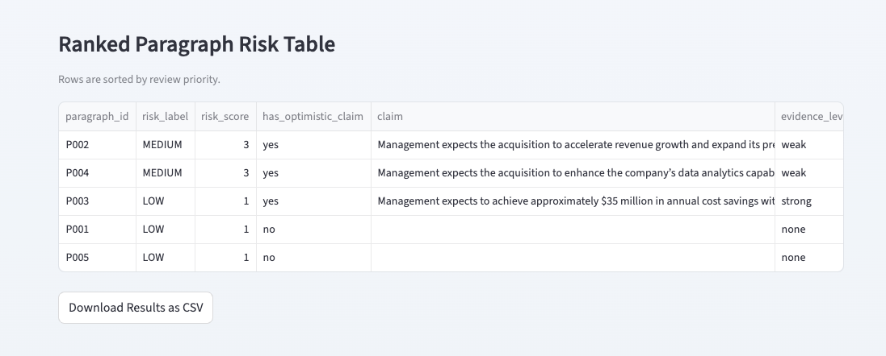
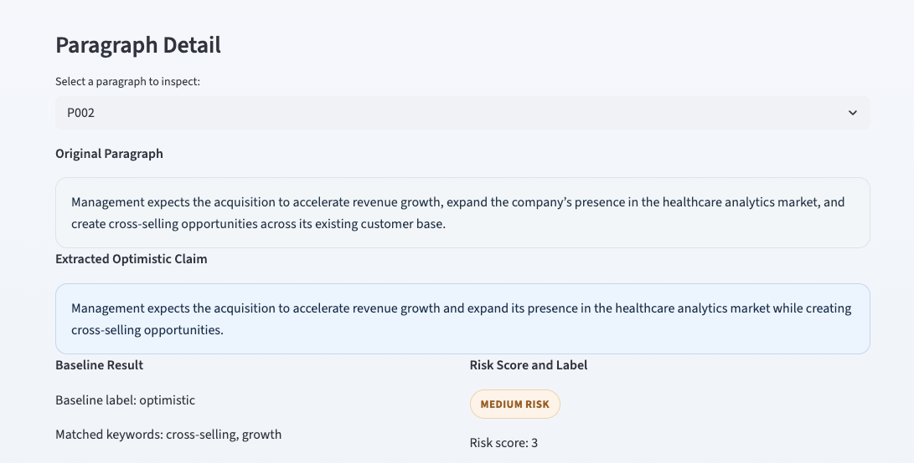
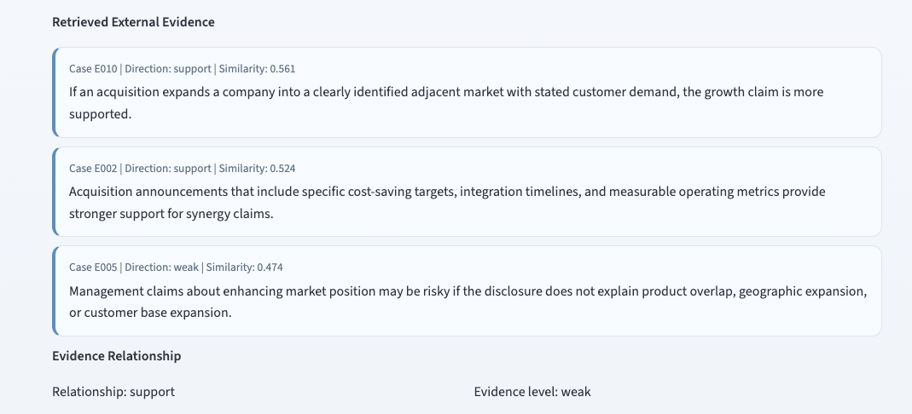
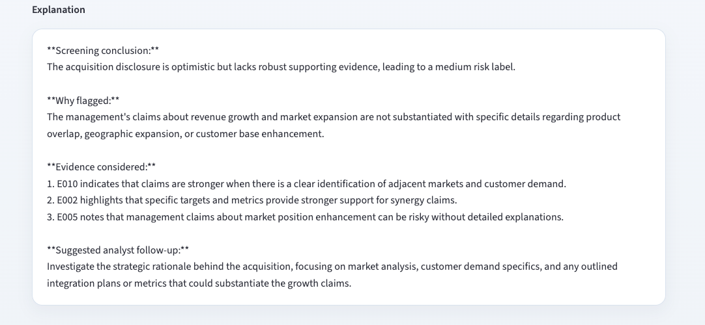

# Evidence-Grounded M&A Disclosure Risk Screener

This project is a Streamlit-based GenAI screening tool for one narrow business use case: identifying optimistic M&A disclosure paragraphs that may require deeper manual review. The app helps a reviewer move from raw disclosure text to paragraph-level screening output with retrieved evidence, risk ranking, and analyst-facing explanation.

## 1. Context, User, and Problem

### Business Context

M&A disclosures often contain persuasive language about:

- synergy realization
- growth acceleration
- market expansion
- operational efficiency
- shareholder value
- strategic positioning

These claims may be reasonable, but they may also be generic, weakly supported, or difficult to validate quickly when a user is reviewing a long filing.

### Specific User

The intended users are:

- financial analysts
- auditors
- disclosure reviewers
- accounting researchers

### Workflow and Problem

These users often review M&A disclosure paragraphs and need to determine which parts of the filing deserve closer scrutiny. The problem is not simply “is the language positive?” The real workflow problem is:

1. identify optimistic M&A claims
2. distinguish stronger support from weaker support
3. rank the paragraphs that may need manual follow-up

This matters because optimistic language about synergy, growth, and value creation may sound persuasive while still lacking concrete evidence, timelines, assumptions, or operational support.

## 2. Solution and Design

### What Was Built

This project is a runnable Streamlit app, not just a notebook or loose script. The user can:

- paste disclosure text
- upload `.txt` files
- upload SEC-style `.html` filings
- try a built-in example disclosure

The app returns paragraph-level screening results, including flagged optimistic paragraphs, retrieved evidence, ranked risk output, and explanation text.

### Workflow

The current workflow is:

`disclosure input -> Text cleaning -> paragraph splitting -> LLM claim extraction -> retrieval -> Evidence relationship classification -> risk scoring -> Analyst-facing explanation generation`

More specifically:

1. The user uploads or pastes an M&A-related disclosure section.
2. The app cleans and splits the text into paragraphs.
3. Each paragraph is screened for optimistic M&A claims.
4. If a claim is detected, the system retrieves related evidence cases from a small external evidence library.
5. The system evaluates whether the retrieved evidence supports, weakly supports, or potentially contradicts the claim.
6. A transparent rule-based scoring layer assigns a low, medium, or high review-risk label.
7. The app generates a concise analyst-facing explanation to help the reviewer prioritize manual follow-up.

The final output is a ranked paragraph-level screening result rather than a single chatbot response.

### Key GenAI Design Choices

The system is intentionally hybrid rather than fully LLM-driven.

- LLM for claim extraction and claim rewriting when `OPENAI_API_KEY` is available
- LLM for analyst-facing explanation generation when `OPENAI_API_KEY` is available
- retrieval from an evidence library to ground the output beyond the pasted paragraph
- rule-based risk scoring for transparency and stable behavior
- fallback mode if no API key is provided

### LLM Usage

The project does use the OpenAI API, but only in a modest and controlled way.

- `extract_claim_llm(paragraph)` is used for optimistic claim extraction and rewriting
- `generate_explanation_llm(...)` is used for concise analyst-facing explanations

The system does not rely entirely on the LLM. Retrieval, paragraph ranking, and risk scoring are intentionally kept transparent and partially rule-based so the workflow remains explainable and stable.

If an `OPENAI_API_KEY` is available:

- the app uses the OpenAI API for claim extraction and explanation generation
- the UI indicates that LLM mode is enabled

If `no API key is available`:

- the app automatically falls back to local rule-based extraction and template explanations
- retrieval and evaluation still function
- the app remains fully runnable for grading purposes

### Why This Is Not Just a Prompt-Only Chatbot

A prompt-only chatbot can summarize or comment on pasted disclosure text, but this project focuses on a structured review workflow rather than a single conversational response.

The system adds:

- paragraph-level screening
- external evidence retrieval
- baseline comparison
- transparent risk scoring
- ranked review output
- evaluation on labeled test sets

The retrieval step is especially important because the output is grounded in an external evidence library rather than relying only on the pasted paragraph.

The project therefore functions more like a lightweight analyst workflow tool than a general-purpose chatbot.

## 3. Evaluation and Results

### Baseline

The baseline is a keyword-only optimistic detection model. It checks whether optimistic words appear in a paragraph, but it does not:

- retrieve evidence
- classify evidence relationships
- rank risk
- generate grounded explanations

### Evaluation Sets

The project uses two evaluation sets.

#### Manual Test Set

- File: `data/test_cases.csv`
- Purpose: small but carefully labeled paragraph-level evaluation set

#### Synthetic Robustness Set

- File: `data/generated_test_cases.csv`
- Purpose: larger generated set covering broader M&A disclosure patterns

### Current Results

The current repository results are:

#### Manual Evaluation Set

| Metric                                 | Result |
| -------------------------------------- | -----: |
| Claim detection accuracy               |   0.95 |
| Evidence level agreement               |   0.80 |
| Risk label accuracy                    |   0.75 |
| Baseline optimistic detection accuracy |   0.60 |
| Proposed system risk accuracy          |   0.75 |

#### Synthetic Robustness Set

| Metric                                 | Result |
| -------------------------------------- | -----: |
| Claim detection accuracy               |   0.88 |
| Evidence level agreement               |   0.57 |
| Risk label accuracy                    |   0.63 |
| Baseline optimistic detection accuracy |   0.58 |
| Proposed system risk accuracy          |   0.63 |

### What Worked

Several aspects of the workflow worked consistently during testing:

- Paragraph-level screening was effective for surfacing optimistic M&A language.
- The retrieval step improved grounding compared with the keyword-only baseline.
- The proposed workflow consistently outperformed the baseline in review-risk classification.
- The ranked output helped prioritize which disclosure paragraphs deserved closer manual review.
- The app remained usable even without an API key because fallback logic was implemented.

The project worked best on:

- M&A press releases
- acquisition announcement sections
- SEC 8-K M&A-related disclosure text
- moderately clean copied filing text

### What Failed / Limitations in Evaluation

The project still has several limitations.

- The evidence library is relatively small and synthetic.
- Retrieval quality depends heavily on the coverage of the evidence cases.
- Some strategic language is difficult to classify because it is mildly optimistic but not clearly promotional.
- Full SEC filings often contain noisy formatting, legal exhibits, signatures, and accounting sections that reduce screening quality.
- PDF parsing is not yet production-ready.
- The evaluation sets are still relatively small compared with real production systems.

The tool is therefore best viewed as a prototype workflow screener rather than a production assurance system.

### Where Human Should Stay Involved

This tool is a first-pass screener. Human reviewers should remain involved for:

- verify whether claims are materially misleading
- cross-check assumptions elsewhere in the filing
- evaluate management credibility
- review integration risks and operational feasibility
- make final audit, investment, or disclosure judgments

The tool should be used to prioritize review, not replace professional judgment.

## 4. Artifact Snapshot

This section is intended for final submission screenshots and optional demo media.

### Sample Input

```text
On April 15, 2024, Company A completed the acquisition of Company B for a total purchase price of $480 million, subject to customary working capital adjustments.

Management expects the acquisition to accelerate revenue growth, expand the company’s presence in the healthcare analytics market, and create cross-selling opportunities across its existing customer base.

The company anticipates achieving approximately $35 million in annual cost savings within 24 months through supply chain integration and operational efficiencies.

The acquired business contributed $120 million in revenue in the prior fiscal year and is expected to enhance the company’s data analytics capabilities.

The transaction will be accounted for as a business combination under applicable accounting standards, and goodwill is expected to be recognized.
```

### Sample Output Summary

- Paragraphs analyzed: 5
- Optimistic paragraphs detected
- High-risk paragraphs flagged if claims lack concrete support
- Retrieved evidence shown for each flagged paragraph
- CSV results can be downloaded

### Screenshot Placeholders

- Screenshot 1: Main screener interface
  .png>)
  .png>)

- Screenshot 2: Ranked paragraph risk table
  

- Screenshot 3: Paragraph detail with retrieved evidence
  
  
  

- Optional screenshot files can be placed in a `screenshots/` folder before submission

If available, a short clip or GIF showing upload -> screening -> paragraph review can also be added here.

## 5. Setup and Usage Instructions

### Clone the Repository

```bash
git clone https://github.com/Lillian-Zhao-droid/evidence-grounded-ma-risk-screener.git
cd evidence-grounded-ma-risk-screener
```

### Create and Activate a Virtual Environment

macOS / Linux:

```bash
python -m venv .venv
source .venv/bin/activate
```

Windows:

```bash
python -m venv .venv
.venv\Scripts\activate
```

### Install Dependencies

```bash
pip install -r requirements.txt
```

### Add the API Key

Copy the example file:

```bash
cp .env.example .env
```

Then edit `.env` and add:

```env
OPENAI_API_KEY=your_api_key_here
```

### Generate Synthetic Test Cases

```bash
python generate_synthetic_tests.py
```

### Run Evaluation

```bash
python evaluation.py
```

### Run the App

```bash
streamlit run app.py
```

### API Key / Fallback Behavior

- If no API key is provided, the app runs in fallback rule-based mode.
- With an API key, LLM mode enables improved claim extraction and explanation generation.
- The app does not print or expose the API key.

## 6. Repository Structure

| Path                                       | Purpose                                                                                                                   |
| ------------------------------------------ | ------------------------------------------------------------------------------------------------------------------------- |
| `app.py`                                   | Streamlit app with Screener and Project Overview pages                                                                    |
| `core.py`                                  | Core workflow logic: cleaning, splitting, claim extraction, retrieval, evidence classification, risk scoring, explanation |
| `evaluation.py`                            | Evaluation runner for manual and synthetic sets                                                                           |
| `generate_synthetic_tests.py`              | Generates the synthetic robustness evaluation set                                                                         |
| `requirements.txt`                         | Python dependencies                                                                                                       |
| `.env.example`                             | Example environment variable file for API key setup                                                                       |
| `data/evidence_library.csv`                | Evidence library used for retrieval                                                                                       |
| `data/test_cases.csv`                      | Manual evaluation set                                                                                                     |
| `data/generated_test_cases.csv`            | Synthetic robustness evaluation set                                                                                       |
| `results/evaluation_results.csv`           | Manual evaluation results                                                                                                 |
| `results/generated_evaluation_results.csv` | Synthetic robustness evaluation results                                                                                   |

## 7. Limitations and Future Improvements

### Limitations

- Small evidence library
- Prototype only
- Not audit or investment advice
- Works best on M&A-related disclosure sections rather than entire long filings
- HTML parsing is basic and PDF support is not yet production-ready
- Evaluation is still limited by synthetic evidence and small manual labeling coverage

### Future Improvements

- larger SEC 8-K evidence library
- better PDF and HTML parsing
- stronger expert-labeled evaluation sets
- broader evidence grounding from analyst reports or post-merger outcomes
- improved LLM-assisted claim extraction and explanation quality

## Final Note

This project satisfies the course requirement of building a small GenAI app/tool for one narrow business workflow.

The workflow focus is intentionally narrow: screening optimistic M&A disclosure claims that may require deeper review. The project is designed to demonstrate workflow design, evaluation, retrieval grounding, and human-AI collaboration rather than fully automated financial judgment.
